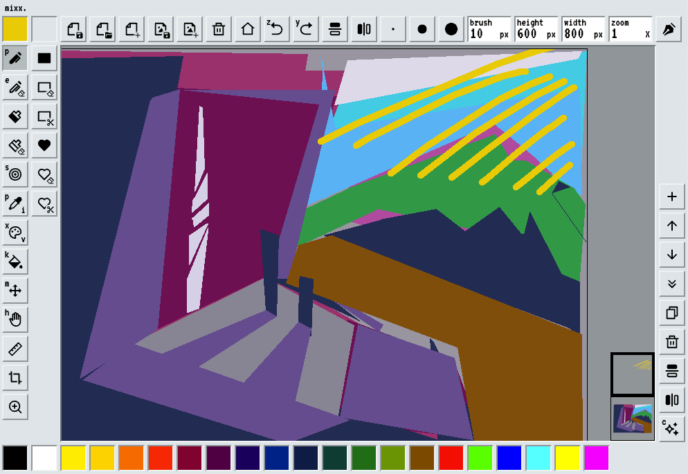

#  mixx

**mixx** is a web app for virtual painting.

*"Colors were made for mixxing, NOT 'picking'..."*

Play with mixx right now on [mixx.studio](https://mixx.studio) or download the
latest release from the [releases
page](https://github.com/gregoryleeman/mixx/releases).

### Attribution

This project includes code from [Mixbox](https://github.com/scrtwpns/mixbox),
which is provided under the CC BY-NC 4.0 license for non-commercial use only.

### License

This project is licensed under the [CC BY-NC 4.0
License](https://creativecommons.org/licenses/by-nc/4.0/). This means it is
free to use and modify for non-commercial purposes, but proper attribution must
be given, and any commercial use requires separate permission.
